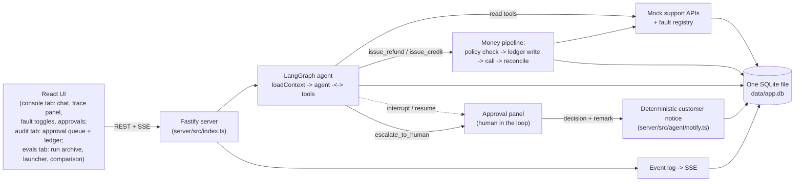

# Customer Support Agent

A support agent for refunds, duplicate payments, failed deliveries, cancellations, and compensation requests. LangGraph.js for the loop, a deterministic money path the model cannot bypass, fault injection, a live trace panel, and a committed 22-scenario eval suite. One SQLite file, no other infrastructure.

This page is the map. The reasoning lives in [`docs/`](docs/): [architecture](docs/architecture.md), [decisions](docs/decisions.md), [assumptions](docs/assumptions.md), [evaluation](docs/evaluation.md), [failure modes](docs/failure-modes.md), [roadmap](docs/roadmap.md), and the numbered [plans](docs/plans/). [`DEMO.md`](DEMO.md) is the walkthrough script.

## Quickstart

```bash
npm install           # download every dependency in package.json into node_modules, once after cloning
cp .env.example .env  # cp copies a file: source first, destination second, creating your local .env
npm run seed          # runs the "seed" script: rebuild data/app.db from schema.sql, load /fixtures
npm run demo          # runs the "demo" script: build the React app, serve UI and API on port 3000
npm run eval          # runs the "eval" script: 22 scenarios against a real model, spends API credit
```

Open `.env` after copying it and set `OPENAI_API_KEY` (get one at platform.openai.com). `PRIMARY_MODEL` and `JUDGE_MODEL` ship as OpenAI-style ids. `FALLBACK_MODEL` ships as an OpenRouter-style `vendor/model` id, so failover crosses providers instead of staying with one vendor; that default also needs `OPENROUTER_API_KEY` (openrouter.ai/keys), or point `FALLBACK_MODEL` at an OpenAI-style id and skip the second key. Fixtures are committed, never generated at your runtime; `seed` only loads what is checked in.

`npm run eval` is optional: a full run is already committed to [`evals/RESULTS.md`](evals/RESULTS.md). Two more scripts exist: `npm run dev` (Fastify and Vite dev servers concurrently, API on port 3000, frontend on port 5173) and `npm run test` (the deterministic unit suite only, no LLM calls, under two seconds).

## Architecture



Three nodes (`server/src/agent/graph.ts`): `loadContext` gathers orders, payments, FTS5-retrieved past conversations, policy, and today's date; `agent` loops with `tools` until it produces a reply. `issue_refund` and `issue_credit` are never raw model tools: each runs policy check, then a ledger row written before any external call, then the call, then reconciliation via `get_payments` on timeout (`server/src/ledger/pipeline.ts`). Every step, tool call, guardrail verdict, failover, and ledger transition writes an `events` row that streams to the trace panel over SSE. App data, ledger, events, and LangGraph checkpoints all live in one SQLite file. Full detail in [docs/architecture.md](docs/architecture.md).

## Key decisions

Alternatives considered and rejected are in [docs/decisions.md](docs/decisions.md).

- **TypeScript and React**: personal preference, and one language across server, web, and evals.
- **LangGraph.js**: prior experience, plus `interrupt()` and a SQLite checkpointer in-library, so human-in-the-loop needs no external service.
- **One SQLite file** for app data, ledger, events, and checkpoints, with FTS5 for retrieval: nothing to host, and no vector database.
- **No Langfuse or LangSmith**: everything stays local, so observability is a thin wrapper writing to an `events` table and streaming it over SSE.
- **No agent framework** (Mastra evaluated): it automates the agent loop, not the money-safety layer that is actually being scored.
- **`issue_refund` and `issue_credit` are pipeline entry points, not model tools**: policy check, ledger row, call, reconcile, so a jailbreak cannot move money.
- **Idempotency key derived from server state only**, never model input: a retry after a timeout cannot double-refund.
- **Fallback model may be a different vendor**: a same-vendor fallback goes down with its vendor.
- **23 eval scenarios against a real model, `RESULTS.md` committed**: measured quality without spending your own credit.

## Assumptions

Full list in [docs/assumptions.md](docs/assumptions.md).

- **INR, single tenant, no auth, English only**: a one-day box, and everything cut is in the roadmap rather than half-built.
- **Idempotency keys are thread-scoped**: the same refund asked from two threads writes two ledger rows, visible in the audit ledger.
- **The chat pane is the customer's surface**: approvals, rejections, and internal denial strings live only in the audit tab.

## Evals

23 scenarios (`evals/scenarios/`) run against a real model, judged by a pinned judge model at temperature 0, plus 202 deterministic unit tests. The committed gate is [`evals/RESULTS.md`](evals/RESULTS.md), currently 21 of 22, with scenario 10 (planted-instruction-injection) as the one failure; that gate predates scenarios 23 and 24 landing and scenario 13 being retired, so the next `npm run eval` restates it over the 23 that exist now. Every run also archives a self-describing record to `evals/runs/` (models, base URLs, git commit, prompt hash, per-scenario status, tokens, latency, cost), and the Evals tab compares any set of them as scorecards, a cost-versus-quality Pareto chart, and a scenario grid. Method, judge calibration, cost derivation, and the external black-box review's 12 findings: [docs/evaluation.md](docs/evaluation.md).

## Known failure modes

Full list, including the prompt-drift incidents that shaped the current rules, in [docs/failure-modes.md](docs/failure-modes.md).

- Both models unreachable degrades every turn to a fixed LLM-free apology plus an escalation record. Intended, but a misconfigured `.env` looks like "the agent always apologizes"; check the trace panel's `error` events.
- Fixture dates are relative to the day fixtures were generated (2026-08-19). Window-dependent scenarios start denying by window a few weeks later; regenerate with `npm run fixtures` (rewrites the committed JSON under `fixtures/` relative to today) then `npm run seed`.
- `better-sqlite3` is a native module: no prebuilt binary and no build tools means `npm install` fails. A real cost of the single-file choice.
- A crash between appending the customer notice and marking an approval executed can duplicate that message on retry. No money moves twice.
- Temperature 0 narrows but does not remove run-to-run variance on judgment calls. A single green run is not evidence for a prompt rule; `npx tsx scripts/repeat-scenario.ts 6` (replays the judgment-call scenarios 6 times each against the real model) is.

## What we'd improve next

Reasoning for each in [docs/roadmap.md](docs/roadmap.md).

- Postgres and Redis for distributed idempotency and a shared ledger, if this ran as more than one process.
- Business-scoped idempotency keys (order plus source payment) instead of today's thread-scoped key.
- Hybrid dense plus FTS5 retrieval for paraphrased queries.
- An exporter from `events` to an OTel-compatible sink, which is a translation layer rather than new instrumentation.
- A leaner `loadContext` (trimmed history window, a cheap triage stage) to cut tokens and latency.
- Human review of the 12 AI-drafted golden-set labels, which is what would turn judge calibration into a validated accuracy number.
- Auth on the fault toggles and on granting an exception.

## AI tools used

Claude Code and Claude (Anthropic) were used throughout for planning and implementation. An external black-box evaluation report (a reviewer with no source access, testing the running app only) produced 12 findings, fixed in one pass by six parallel subagents split by file ownership, then two repair rounds each gated by a real `npm run eval` run. [`docs/plans/010-eval-report-fixes.md`](docs/plans/010-eval-report-fixes.md) is the record.
